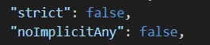
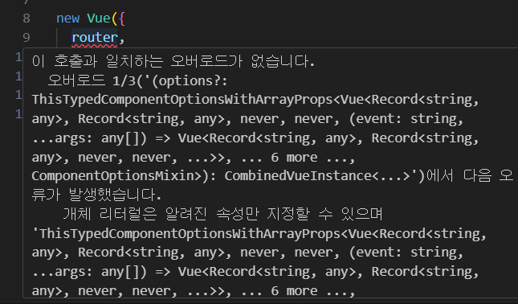

# vue-news

<br />

## typeScript 점진적으로 적용하기

vue로도 개발을 충분히 할 수 있지만 <br />
API 호출 해오고 데이터의 스펙을 정의하는 부분에서 TypeScript가 용이함!

<br />
1. Vue + TypeScript 프로젝트 생성
2. 기존 서비스 코드와 라이브러리를 새 프로젝트에 이동
3. 기본적인 빌드 에러 해결
4. TypeScript의 혜택을 볼 수 있는 주요 파일들 위주로 .js -> .ts로 변환하며 적용

<br />
* tip! 타입 체킹 정도는 덜 엄격한 방식 -> 점점 엄격한 방식으로 적용

### .js -> .ts로 바꾸기

1. 기본적인 타입 에러 해결하기
2. 구체적으로 타입을 정해줄 수 있는 곳에 타입 정의

<br />

### TypeScript의 stirct option 상향시키기

tsconfig.json의 strict: "true" 로 수정 <br />

### API 호출

ListView.vue

```vue
<script>
methods: {
  // api의 index.ts의 fetchNews 호출하기
  // async, await
  // async의 기본적인 return 값은 promise
  // -> async로 비동기처리 하는 데 있어서 실수 방지o, 사용 하는 게 좋음
  async fetchNewsItems() {
  // fetchNews에 대한 결과를 response로 받아올게
  const response = await fetchNews();
  this.newsItems =response.data;
  },
},
// ListView 컴포넌트가 생성되자 마자 fetchNewsItems 메서드 호출
created() {
  this.fetchNewsItems();
},
</script>
```

<br />

### Props 속성 타입 정의

PropType <br />
vue 내부적으로 제공하는 type 사용 가능<br />
제네릭으로 이게 어떤 타입이야! 를 지정해줄 수 있음

```vue
<script>
import Vue, { PropType } from "vue";

export default Vue.extend({
  props: {
    items: {
      type: Array as PropType<NewsItem[]>,
      required: true,
    },
  },
})
</script>
```

<br />

### store vuex 타입 추론

store.ts

```vue
// vuex의 state 정의
<script>
export default new Vuex.Store({
  strict: process.env.NODE_ENV !== "production",
  state: {
    news: [],
    ask: [],
    jobs: [],
    user: {},
    item: {},
    list: [],
  },
  getters,
  mutations,
  actions,
});
</script>
```

이렇게 하면 다른 컴포넌트에서 vuex의 state에 대한 타입 추론이 안됨 <br />

1. index.ts에 전부 정의하는 것보다는 모듈화 하기
2. 컴포넌트에서 추론할 수 있도록 하기
   node_modules > vuex > types > vue.d.ts <br />
   Store type을 RootStore로 수정

   ```vue
   declare module "vue/types/vue" {
    interface Vue {
      $store: Store<RootStore>;
    }
   }
   ```

<br />

### mutations type 정의

store 밑에 별도의 파일로 작성 <br />

1. state.ts의 state타입 불러오기
2. mutation의 타입 -> enum으로 선언
3. 속성 함수 -> 2의 mutation타입을 이용해서 [mutation 속성함수 이름] 정의
   mutation의 첫번째 파라미터: state(타입은 위에서 넘겨 받은 RootState ), <br />
   두 번째 파라미터: mutation을 호출할 때 넘겨줘도 되고 안넘겨줘도 되는 payload
4. export type Mutations = typeof mutations에 넣어주기

```vue
<script>
// 1
import { RootState } from "./state";
import { NewsItem } from "@/api";

// 2
enum MutationTypes {
  SET_NEWS = "SET_NEWS",
}

// 3
const mutations = {
  [MutationTypes.SET_NEWS](state: RootState, news: NewsItem[]) {
    state.news = news;
  },
};


//4
type Mutations = typeof mutations;

export { mutations, Mutations };
</script>
```

<br /> <br />

---

<br />

### actions type 정의

1. vuex에서 제공하는 ActionsContext라는 내부 타입, state, RootState 들고오기
2. enum으로 ActionsType 정의

```
  enum ActionTypes {
    FETCH_NEWS = "FETCH_NEWS",
  }

  type MyActionContext = {
    commit<K extends keyof Mutations>(
      key: K,
      payload: Parameters<Mutations[K]>[1]
    ): ReturnType<Mutations[K]>;
  } & Omit<ActionContext<RootState, RootState>, "commit">;

  // action 함수를 이용해서 fetchNews라는 action 함수를 호출했을 때
  // 얘를 받아와서 mutation으로 state에 저장해주고
  // state에 저장된 것을 컴포넌트에서 갖다 쓸 수 있는 형태로 만듦
  const actions = {
    // ActionTypes에 FETCH_NEWS를 이용해서
    // context를 이용할건데 얘는 vuex에서 제공하는 ActionContext를 받을고야
    async [ActionTypes.FETCH_NEWS](context: MyActionContext, payload?: any) {
      const { data } = await fetchNews();
      context.commit(MutationTypes.SET_NEWS, data);
    },
  };

  type Actions = typeof actions;
  export { ActionTypes, actions, Actions };
```

## 🗑️Grammer Dump🗑️

### & (intersection)

```
type A = {
  name: string
}
type B = {
  age: number
}

type C = A & B

const person: C = {
  name: "a"
  // age: 10  -> 얘 빼먹으면 너 age 어디갔어! 하고 에러 토해줌
}
```

<br />

### Omit

정의된 type 중 특정 키만 빼고 나머지를 가져올게

```
  const person = {
    name: "a",
    age: 10,
    skill: 'JS'
  }

  const josh = Omit<person, 'skill'>
  // person에서 skill만 빼줭~
  // person의 name, age만 해당

  // josh의 결과
  josh = {
    name: 'a',
    age: 10
  }
```

types.ts

```
export type MyStore = Omit<Store<RootState>, "commit"> & MyMutations;
```

Omit<Store<RootState>, "commit"> <br />
-> Store에서 commit만 빼고 다 가져올게~ <br />
MyMutations <br />
->프로젝트에서 정의한 mutation들의 타입
<br />
commit에 대해 프로젝트 내에서 재정의가 가능 <br />
Vuex의 mutations 타입만 따로 갈아끼워줄 수 o

<br />

## 🗑️Error Dump🗑️

### error) 1. main.ts의 .js 파일 error

 <br />
error: type에 any가 붙어 있어야 하는데 any가 없어! <br />
-> strict 옵션이 true여서
<br />

- strict 옵션 level 낮추기 <br />
  tsconfig.json<br/>
  <br />
  "strict"를 false로 "noImplicitAny": false를 추가해주면 에러 해결 <br />
  noImplicitAny -> 암묵적으로 any 타입을 가지는 것을 허락 x
  <br /><br />

### error) 2. main.ts의 router error



- allowJS 추가
  tsconfig.json
  ```
  "allowJS" : true
  ```

<br /><br />
