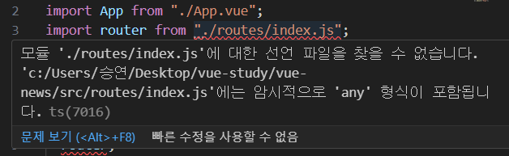

# vue-news

<br />

## typeScript 점진적으로 적용하기

### error) 1. main.ts의 .js 파일 error

 <br />
error: type에 any가 붙어 있어야 하는데 any가 없어! <br />
-> strict 옵션이 true여서
<br />

- strict 옵션 level 낮추기 <br />
  tsconfig.json<br/>
  <br />
  "strict"를 false로 "noImplicitAny": false를 추가해주면 에러 해결 <br />
  noImplicitAny -> 암묵적으로 any 타입을 가지는 것을 허락 x
  <br /><br />

### error) 2. main.ts의 router error


- allowJS 추가
  tsconfig.json
  ```
  "allowJS" : true
  ```

<br />

---

<br />

## .js -> .ts로 바꾸기

1. 기본적인 타입 에러 해결하기
2. 구체적으로 타입을 정해줄 수 있는 곳에 타입 정의
